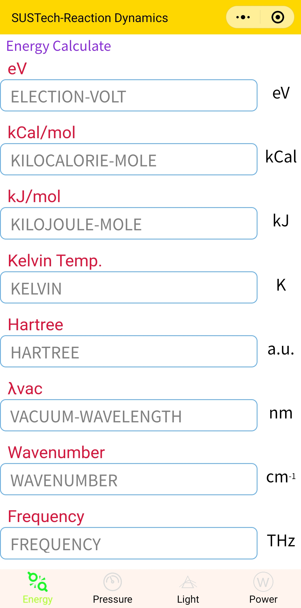
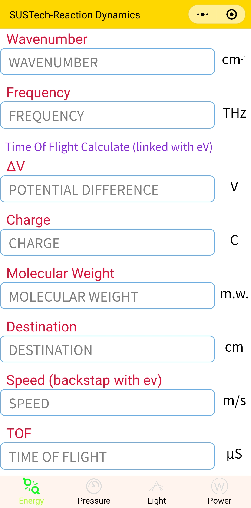
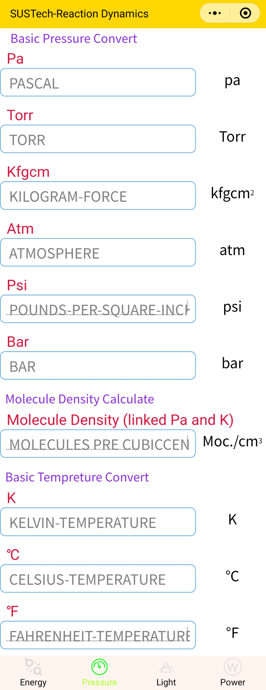
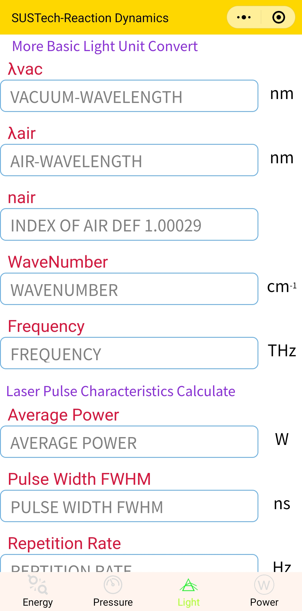
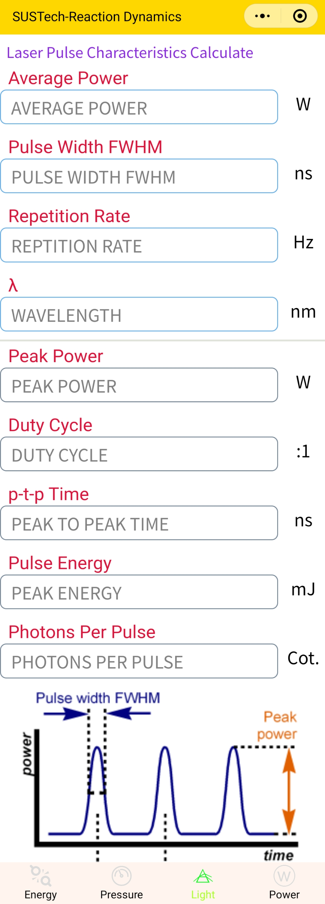
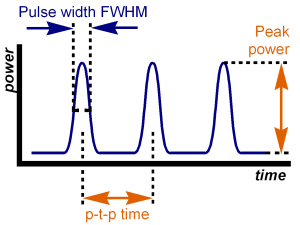
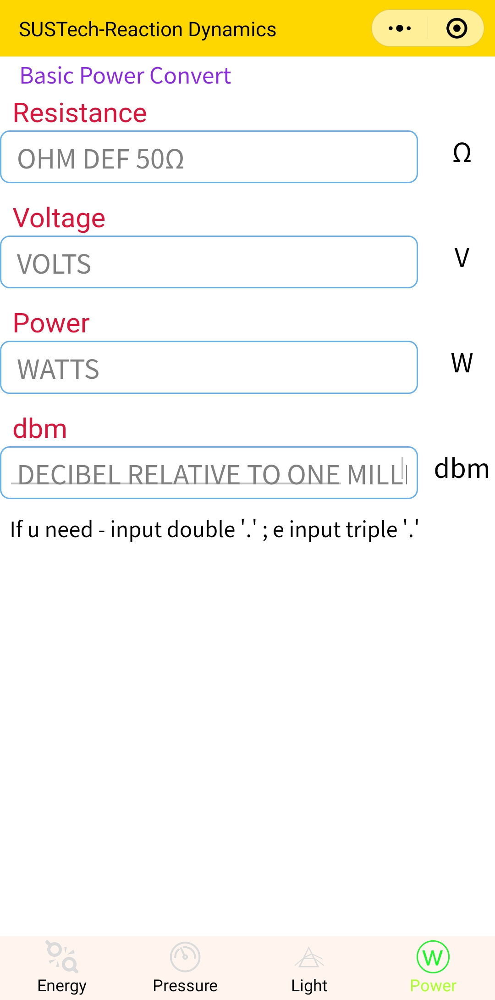

<head>
    
    
</head>

# 多功能单位转换的微信小程序

作者：单坤

---
近日，我实验室开发了一种适用于物理，化学科研实验室反应动力学等方向的科学单位转换器，如常用的化学反应温度，气压，激光波长，功率等单位的转化。本文将对此小程序进行一系列的简单描述与算法展示。

可以在微信中搜索“Units Converter”或者扫描下面的二维码来获取我们的单位转换与计算小程序。

## 1 Energy 部分
### 1.1 Energy Calculate

如上图所示，提供了基本的能量单位与化学反应能量的计算。若按化学反应能量来计算，那么默认的单位是1mol反应的能量。提供了如下单位的换算与计算：

- 电子伏特
- 千卡（每mol）
- 千焦（每mol）
- 开尔文温度
- 哈特里
- 真空波长
- 波数
- 频率（THz）

### 1.2 Time of Filght Calculate

本部分提供了粒子飞行时间的计算。需要提前准备的是，要在模块1-1中保证有效的电子伏特与C--电荷输入，或者保证有效的$\Delta$V--平行场电压和C--电荷输入，以表明能量输入的合法性；接着需要输入分子量，此时可以算出飞行速度；最后输入飞行距离，便可以算出飞行所需时间。仅有合法电荷、分子量和飞行速度的情况下，可以反推出所需的电子伏特能量。以上基本计算公式（忽略单位）如下：

- $Speed=\sqrt{\frac{2*\Delta V*C}{m.w.*M_p}}$
- $TOF=\frac{Dest}{Speed}$

## 2 Pressure 部分

### 2.1 Basic Pressure Convert
本部分提供了基本的压力单位转换功能，可转换的单位有：
- 帕斯卡
- 托
- 千克每平方厘米
- 大气压
- 磅平方英寸
- 巴

### 2.2 Molecule Density Calculate
本部分提供了根据理想气体状态方程计算的理想气体分子密度，和2-1部分中的pa与2-3部分的K相关联，并可以互相换算。基本计算公式（忽略单位）如下：
$$MD=\frac{Pa*N_A}{R*K}$$

### 2.3 Basic Temperature
本部分提供了基本的温度转换，可转换的单位有：
- 开尔文温度
- 摄氏度
- 华氏度

## 3 Light 部分
### 3.1 More Basic Light Unit Convert

本部分在Energy部分的关于光粒子性的转换基础上，在此部分拓展了光波动性的单位转换，包含了：

- 真空波长
- 空气波长（与空气折射率有关）
- 空气折射率（默认是1.00029）
- 波数
- 频率

### 3.2 Laser Pulse Characteristics Calculate

本部分通过可输入的一系列激光器可读参数，计算出常用的激光指标，如下：

- 输入
  - 平均功率
  - 脉冲半高宽
  - 脉冲频率
  - 波长
- 输出
  - 峰值功率
  - 脉冲占空比
  - 峰-峰时间
  - 脉冲能量
  - 每个脉冲发射的光子数

以上参数可通过下图来形象的表示：

## 4 Power 部分
### 4.1 Basic Power Convert

本部分提供了基础的电子电路功率转化与计算功能，如下：

- 电阻
- 电压
- 功率
- 分贝毫瓦

其中，分贝毫瓦的计算公式如下：
$$dbm=10\log{\frac{Power}{1mW}}$$

 此外，由于微信官方的weui-input功能不完善，无法做到全平台同步数字键盘，故输入需要用移动端的输入法进行输入，本小程序具有错误检查，对于非法字符会直接无视输入。
 
 如果需要负号则可以输入两次小数点，如果需要指数可以输入三次小数点，不过在开放了输入法键盘的情况下，可以直接输入负号与指数。

 输入的数值可以是任意32位浮点数，例如1.1111或者1.11e11都是合法的。

 ---
 希望这个小程序可以在科研学习中帮到大家，如果有任何问题和建议，可以通过邮件和[作者](mailto:790402351@qq.com)沟通。

2021-06-22

